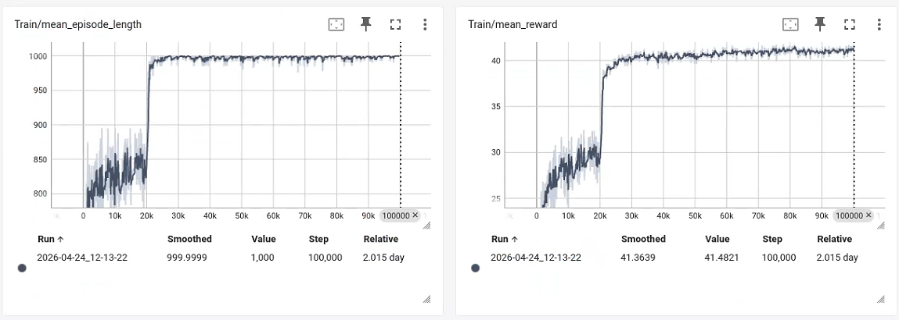

# AMP_mjlab

[English README](README.md)

部署集成代码位于 [ccrpRepo/wbc_fsm](https://github.com/ccrpRepo/wbc_fsm) 项目中的 `MJAmp State`。

基于 mjlab + rsl_rl 的 G1 AMP 运动控制项目。

本项目的核心特点是：

- 使用同一个 policy 同时学习 locomotion（走/跑）与 recovery（跌倒恢复）
- 通过 AMP 判别器约束动作风格与运动先验
- 在训练与导出链路中保持一致，支持直接导出 ONNX policy

## 核心思路

传统做法常把“走跑策略”和“恢复策略”分开训练并做切换；本项目将两类能力放入一个策略中统一学习。

实现要点：

- 运动数据分组：
	- Walk/Run 数据目录：`src/assets/motions/g1/amp/WalkandRun`
	- Recovery 数据目录：`src/assets/motions/g1/amp/Recovery`
- 延迟重置机制（Delayed Termination）：
	- 一部分环境在触发终止后不立即 reset，而是给定恢复窗口
	- 该子集环境优先从 Recovery 片段采样 reset 状态
- 统一 AMP 训练：
	- 单一 actor-critic + 单一 AMP discriminator
	- 在同一训练过程中学习速度跟踪、抗扰动与恢复能力

这样可以减少策略切换带来的状态不连续问题，得到更一致的行为。

## 环境要求

- Linux
- Python 3.11（建议）
- 已可用的 MuJoCo / GPU 驱动环境

## 快速开始

### 1. 安装仓库

```bash
conda activate mjlab
cd AMP_mjlab
python -m pip install -e .
cd rsl_rl
python -m pip install -e .
```

### 2. mjlab 观测补丁（已不再需要）

观测已改为与 DroidUpE1 相同的**单 frame term** 设计（`actor_frame` / `critic_frame` / `amp_state`），原版 mjlab 的 history 展平即为帧优先，**无需再打 `history_ordering` 补丁**。

`mjlab_patch/` 目录仅作历史参考；新环境不必覆盖 site-packages。

### 3. 查看可用任务

```bash
python scripts/list_envs.py --keyword AMP
```

主要任务：

- `Unitree-G1-AMP-Rough`
- `Unitree-G1-AMP-Flat`

## 训练


```bash
python scripts/train.py Unitree-G1-AMP-Flat --env.scene.num-envs=4096
```


日志默认在：

- `logs/rsl_rl/g1_amp_locomotion/<time_stamp_run>/`

## 训练曲线说明（重要）

- 在约 `2w` 轮（约 20k iterations）附近，策略通常会突然学会“跌倒后恢复”行为。
- 对应地，`logs` 中多个指标会出现明显突变（阶跃式变化），这是正常现象，不一定是训练异常。



## 评估与可视化

使用已训练权重回放：

```bash
python scripts/play.py Unitree-G1-AMP-Flat \
	--checkpoint-file logs/rsl_rl/g1_amp_locomotion/<run_dir>/model_<iter>.pt 
```

说明：训练与回放阶段都支持 ONNX 导出（默认开启）。

## 运动数据准备

仓库提供 CSV 到 NPZ 的转换脚本：

```bash
python scripts/csv_to_npz.py --help
```

推荐目录组织：

- 原始 CSV：`motion_data_csv/amp`
- 转换后 NPZ：`src/assets/motions/g1/amp/WalkandRun` 与 `src/assets/motions/g1/amp/Recovery`

只要上述目录中存在可用 NPZ，训练配置会自动加载。

## 目录说明

- `src/tasks/amp_loco`：AMP locomotion/recovery 任务实现
- `src/tasks/amp_loco/config/g1`：G1 任务注册、环境与 RL 配置
- `src/tasks/amp_loco/mdp`：奖励、观测、事件、终止逻辑
- `scripts/train.py`：训练入口
- `scripts/play.py`：回放入口
- `scripts/csv_to_npz.py`：动作数据转换工具
- `mjlab_patch`：依赖的 mjlab 本地补丁

## 项目亮点总结

- 单一策略统一覆盖走跑与跌倒恢复
- AMP + 速度任务联合优化，兼顾风格与任务性能
- 延迟重置与 recovery 采样机制，显式强化恢复能力
- 训练到部署链路完整，支持 ONNX 导出

## 致谢

- 感谢 [unitreerobotics/unitree_rl_mjlab](https://github.com/unitreerobotics/unitree_rl_mjlab) 项目的开源工作与启发。
- 感谢 [Open-X-Humanoid/TienKung-Lab](https://github.com/Open-X-Humanoid/TienKung-Lab)，本项目在 rsl_rl 的 AMP 部分参考了该实现。


 <!-- 力矩课程，delay时间步，可视化  -->


奖励 ，对称性，从初始姿态之外初始化 ，rsl_rl的算法修改 ，domain rand添加  obs改为关节角度以及关节速度
